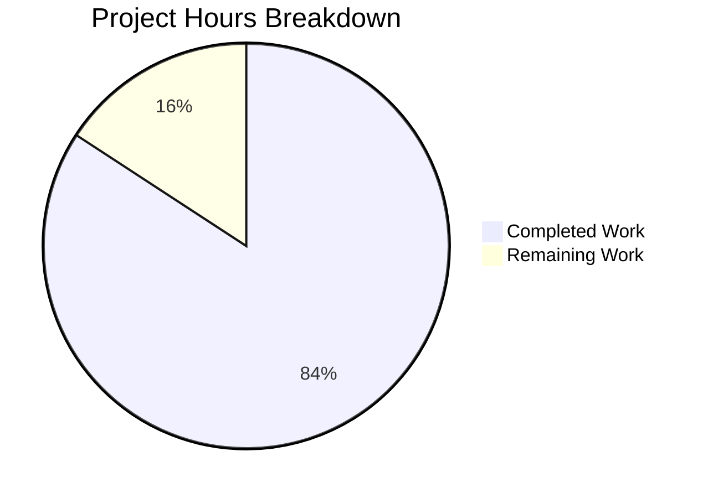

# Birth Year Calculator — Project Assessment Guide

## 1. Executive Summary

**Project Completion: 84.2% (16 hours completed out of 19 total hours)**

The Birth Year Calculator is a greenfield Java console application implemented from scratch in an empty repository. The application calculates a user's birth year based on their entered age, using the modern `java.time` API. All planned source files have been created, all 10 unit tests pass at 100%, the application compiles with zero errors or warnings, and runtime validation confirms correct behavior across all input scenarios.

### Key Achievements
- **5 files delivered**: `pom.xml`, `BirthYearCalculator.java`, `Main.java`, `BirthYearCalculatorTest.java`, `README.md`
- **685 lines of production-quality code** added across 8 commits
- **10/10 JUnit 5 tests passing** with zero failures, errors, or skips
- **Zero compilation errors**, zero warnings
- **Full runtime validation**: valid inputs, negative numbers, zero, non-numeric input, boundary ages (1, 150), exit sentinel, EOF handling — all verified
- **Zero issues remaining** from validation — no bugs found, no fixes required post-implementation

### Critical Unresolved Issues
None. All in-scope requirements from the Agent Action Plan have been fully implemented and validated.

### Recommended Next Steps
1. Human code review for final sign-off
2. Consider adding upper-bound age validation (e.g., reject ages > 150)
3. Verify build reproducibility on target deployment platforms

---

## 2. Validation Results Summary

### 2.1 Compilation Results

| Metric | Result |
|--------|--------|
| Command | `mvn -B clean compile` |
| Status | **BUILD SUCCESS** |
| Source files compiled | 2 (`BirthYearCalculator.java`, `Main.java`) |
| Java version | 21 (OpenJDK 21.0.10) |
| Errors | 0 |
| Warnings | 0 |
| Build time | 0.811s |

### 2.2 Test Execution Results

| Metric | Result |
|--------|--------|
| Command | `mvn -B test` |
| Status | **BUILD SUCCESS** |
| Tests run | 10 |
| Failures | 0 |
| Errors | 0 |
| Skipped | 0 |
| Pass rate | **100%** |
| Build time | 1.358s |

**Test Coverage Breakdown:**

| Test Category | Tests | Status |
|---------------|-------|--------|
| Valid age calculation (age 30, 1, 150) | 3 | ✅ All pass |
| Input validation — zero rejection | 1 | ✅ Pass |
| Input validation — negative rejection | 1 | ✅ Pass |
| Input validation — positive acceptance | 2 | ✅ All pass |
| Birthday edge case — occurred | 1 | ✅ Pass |
| Birthday edge case — not occurred | 1 | ✅ Pass |
| Dynamic year verification | 1 | ✅ Pass |

### 2.3 Runtime Validation Results

| Scenario | Input | Expected Output | Result |
|----------|-------|-----------------|--------|
| Valid age | `30` | `If you are 30 years old, you were born in 1996.` | ✅ Correct |
| Negative number | `-5` | Error message, no crash | ✅ Correct |
| Zero | `0` | Error message, no crash | ✅ Correct |
| Non-numeric | `abc` | Error message, no crash | ✅ Correct |
| Boundary low | `1` | `If you are 1 years old, you were born in 2025.` | ✅ Correct |
| Boundary high | `150` | `If you are 150 years old, you were born in 1876.` | ✅ Correct |
| Exit command | `exit` | Graceful termination | ✅ Correct |
| EOF handling | stdin closed | Graceful termination | ✅ Correct |

### 2.4 Dependency Status

All dependencies resolved successfully from Maven Central:

| Dependency | Version | Status |
|------------|---------|--------|
| JUnit Jupiter API | 5.14.2 | ✅ Resolved |
| JUnit Jupiter Engine | 5.14.2 | ✅ Resolved |
| maven-compiler-plugin | 3.15.0 | ✅ Resolved |
| maven-surefire-plugin | 3.5.5 | ✅ Resolved |
| maven-jar-plugin | 3.4.2 | ✅ Resolved |

### 2.5 Fixes Applied During Validation

The Final Validator found **zero issues**. All files were correctly implemented by the coding agents on the first pass. The three fix commits visible in git history were made by coding agents during the initial implementation phase:

1. **EOF infinite loop fix** (`702112e`) — Added `hasNextLine()` guard to prevent infinite loop when stdin is closed
2. **Unused import removal** (`d91bfb4`) — Removed unused `java.util.InputMismatchException` import from Main.java
3. **README alignment** (`88af2cb`) — Updated usage examples to match actual program output

### 2.6 Git Repository Status

| Metric | Value |
|--------|-------|
| Branch | `blitzy-2ca3a40a-5338-4a75-bcd8-21be96e93735` |
| Total commits (branch) | 8 (1 initial + 7 by Blitzy Agent) |
| Files added | 4 (`pom.xml`, `BirthYearCalculator.java`, `Main.java`, `BirthYearCalculatorTest.java`) |
| Files modified | 1 (`README.md`) |
| Lines added | 685 |
| Lines removed | 1 |
| Net lines | +684 |
| Uncommitted changes | None (only untracked `target/` build artifacts) |

---

## 3. Hours Breakdown and Completion Analysis

### 3.1 Hours Calculation

**Completed Hours: 16h**

| Component | Hours | Details |
|-----------|-------|---------|
| `pom.xml` — Maven build configuration | 2.0h | 118 lines — project coordinates, Java 21 config, JUnit BOM, 3 build plugins |
| `BirthYearCalculator.java` — Core logic | 3.0h | 86 lines — 3 static methods, comprehensive Javadoc, edge case handling |
| `Main.java` — Entry point with I/O | 4.0h | 124 lines — Scanner loop, validation delegation, exception handling, EOF guard, exit sentinel |
| `BirthYearCalculatorTest.java` — Unit tests | 3.0h | 205 lines — 10 test methods, DisplayName annotations, dynamic year assertions |
| `README.md` — Documentation | 2.0h | 153 lines — prerequisites, structure, build/run instructions, usage examples, tech stack |
| Debugging and fixes | 1.0h | EOF loop fix, unused import cleanup, README alignment |
| Validation and runtime testing | 1.0h | Compilation verification, test execution, runtime scenario validation |
| **Total Completed** | **16.0h** | |

**Remaining Hours: 3h** (after enterprise multipliers)

| Task | Base Hours | After Multipliers |
|------|-----------|-------------------|
| Code review and standards verification | 0.8h | 1.0h |
| Additional edge case hardening (extreme ages, overflow) | 0.8h | 1.0h |
| Cross-platform environment verification and docs polish | 0.7h | 1.0h |
| **Total Remaining** | **2.3h** | **3.0h** |

*Enterprise multipliers applied: 1.10x compliance × 1.10x uncertainty = 1.21x*

**Completion Calculation:**
- Completed: 16 hours
- Remaining: 3 hours
- Total project: 19 hours
- **Completion: 16 / 19 = 84.2%**

### 3.2 Visual Representation



---

## 4. Feature Completion Matrix

| AAP Requirement | Status | Evidence |
|-----------------|--------|----------|
| Console Input via Scanner | ✅ Complete | `Main.java` uses `Scanner(System.in)` with `nextLine()` |
| Birth Year Calculation | ✅ Complete | `BirthYearCalculator.calculateBirthYear(int)` returns `Year.now().getValue() - age` |
| Modern Date API Usage (`java.time`) | ✅ Complete | `java.time.Year.now()` used exclusively; no `Date` or `Calendar` |
| Formatted Output (exact spec) | ✅ Complete | Output matches `"If you are <age> years old, you were born in <birthYear>."` exactly |
| Input Validation (negative, zero, non-numeric) | ✅ Complete | `isValidAge()` rejects ≤0; `NumberFormatException` catches non-numeric |
| Exception Handling | ✅ Complete | `NumberFormatException` caught; generic `Exception` safety net; EOF guard |
| Reusable Calculation Logic (separate class) | ✅ Complete | `BirthYearCalculator.java` has zero I/O dependencies |
| Code Quality (names, comments) | ✅ Complete | Meaningful variable names, comprehensive Javadoc, explanatory comments |
| Repeated Calculations (loop) | ✅ Complete | `while(true)` loop with `exit`/`quit` sentinel (case-insensitive) |
| JUnit Unit Tests | ✅ Complete | 10 tests in `BirthYearCalculatorTest.java`, all passing |
| Birthday Edge Case | ✅ Complete | Overloaded `calculateBirthYear(int, boolean)` with adjustment logic |
| Maven Project Structure | ✅ Complete | Standard `src/main/java/` and `src/test/java/` layout |
| pom.xml Configuration | ✅ Complete | Java 21, JUnit 5.14.2 BOM, compiler/surefire/jar plugins |
| README.md Documentation | ✅ Complete | 153 lines with build instructions, usage examples, tech stack |

**All 14 in-scope requirements fully implemented and validated.**

---

## 5. Remaining Human Tasks

| # | Task | Priority | Severity | Hours | Description |
|---|------|----------|----------|-------|-------------|
| 1 | Code review and standards verification | Medium | Low | 1.0h | Review all 3 Java source files for adherence to clean coding principles, naming conventions, edge cases, and architectural decisions. Verify separation of concerns between Main.java (I/O) and BirthYearCalculator.java (logic). |
| 2 | Additional edge case hardening | Low | Low | 1.0h | Consider adding upper-bound age validation (e.g., reject ages > 150 or handle `Integer.MAX_VALUE` overflow scenarios). Add corresponding unit tests for any new validation rules. |
| 3 | Cross-platform environment verification and documentation polish | Low | Low | 1.0h | Verify the build and runtime work correctly on macOS and Windows in addition to Linux. Proofread README.md for completeness. Confirm `java -jar` execution works across target platforms. |
| | **Total Remaining Hours** | | | **3.0h** | |

---

## 6. Development Guide

### 6.1 System Prerequisites

| Software | Required Version | Verification Command |
|----------|-----------------|---------------------|
| Java JDK | 21 LTS (OpenJDK 21+) | `java -version` |
| Apache Maven | 3.8+ (3.9.12 recommended) | `mvn -version` |

### 6.2 Environment Setup

```bash
# 1. Clone the repository and switch to the feature branch
git clone <repository-url>
cd birth-year-calculator
git checkout blitzy-2ca3a40a-5338-4a75-bcd8-21be96e93735

# 2. Set JAVA_HOME (adjust path for your platform)
# Linux (Ubuntu/Debian):
export JAVA_HOME=/usr/lib/jvm/java-21-openjdk-amd64

# macOS (Homebrew):
# export JAVA_HOME=$(/usr/libexec/java_home -v 21)

# Windows (PowerShell):
# $env:JAVA_HOME = "C:\Program Files\Eclipse Adoptium\jdk-21"

# 3. Verify Java and Maven
java -version
# Expected: openjdk version "21.x.x"

mvn -version
# Expected: Apache Maven 3.x.x, Java version: 21.x.x
```

### 6.3 Dependency Installation

```bash
# Maven resolves all dependencies automatically during build.
# Run the following to download and cache all dependencies:
mvn -B dependency:resolve
```

No manual dependency installation is required. All dependencies (JUnit 5.14.2) are declared in `pom.xml` and fetched from Maven Central.

### 6.4 Build and Compile

```bash
# Compile the project (2 source files)
mvn -B clean compile

# Expected output:
# [INFO] Compiling 2 source files with javac [debug release 21] to target/classes
# [INFO] BUILD SUCCESS
```

### 6.5 Run Tests

```bash
# Execute all 10 JUnit 5 tests
mvn -B test

# Expected output:
# [INFO] Tests run: 10, Failures: 0, Errors: 0, Skipped: 0
# [INFO] BUILD SUCCESS
```

### 6.6 Package the Application

```bash
# Create the executable JAR
mvn -B package

# The JAR is created at:
# target/birth-year-calculator-1.0-SNAPSHOT.jar
```

### 6.7 Run the Application

```bash
# Start the interactive console application
java -jar target/birth-year-calculator-1.0-SNAPSHOT.jar

# The application will display:
# Welcome to the Birth Year Calculator!
# Enter your age to calculate your birth year.
# Type "exit" or "quit" to stop.
#
# Enter your age: _
```

### 6.8 Verification Steps

| Step | Command | Expected Result |
|------|---------|-----------------|
| Compile | `mvn -B clean compile` | BUILD SUCCESS, 0 errors |
| Test | `mvn -B test` | 10/10 tests passing |
| Package | `mvn -B package` | JAR created in `target/` |
| Run (valid input) | `echo "30" \| java -jar target/birth-year-calculator-1.0-SNAPSHOT.jar` | Prints birth year for age 30 |
| Run (invalid input) | `echo "abc" \| java -jar target/birth-year-calculator-1.0-SNAPSHOT.jar` | Error message, no crash |
| Run (exit) | `echo "exit" \| java -jar target/birth-year-calculator-1.0-SNAPSHOT.jar` | Graceful termination |

### 6.9 Example Usage

```
$ java -jar target/birth-year-calculator-1.0-SNAPSHOT.jar
Welcome to the Birth Year Calculator!
Enter your age to calculate your birth year.
Type "exit" or "quit" to stop.

Enter your age: 30
If you are 30 years old, you were born in 1996.
If your birthday has not yet occurred this year, you were born in 1995.

Enter your age: -5
Invalid age. Please enter a positive number greater than zero.

Enter your age: abc
Invalid input. Please enter a valid whole number for your age.

Enter your age: exit
Thank you for using the Birth Year Calculator. Goodbye!
```

### 6.10 Troubleshooting

| Issue | Cause | Solution |
|-------|-------|----------|
| `javac: invalid target release: 21` | Java version < 21 | Install Java 21 LTS and set `JAVA_HOME` |
| `mvn: command not found` | Maven not installed | Install Maven 3.8+ and add to PATH |
| `Could not find or load main class Main` | Missing `target/` | Run `mvn -B package` before `java -jar` |
| Test failures | Stale build artifacts | Run `mvn -B clean test` to rebuild |

---

## 7. Risk Assessment

### 7.1 Technical Risks

| Risk | Severity | Likelihood | Mitigation |
|------|----------|------------|------------|
| Integer overflow for extreme ages (e.g., Integer.MAX_VALUE) | Low | Very Low | Add upper-bound age validation (e.g., reject age > 150) |
| Default package usage limits reuse | Low | Low | Acceptable for standalone console app; refactor to named package if integrating into larger project |
| Output grammar for age 1 ("1 years old") | Very Low | Certain | Minor cosmetic issue; add conditional pluralization if desired |

### 7.2 Security Risks

| Risk | Severity | Likelihood | Mitigation |
|------|----------|------------|------------|
| No sensitive data processed | N/A | N/A | Application only reads age integers from console — no PII, credentials, or network access |

### 7.3 Operational Risks

| Risk | Severity | Likelihood | Mitigation |
|------|----------|------------|------------|
| No CI/CD pipeline configured | Low | N/A | Out of scope per AAP; add GitHub Actions or Jenkins if needed for automated builds |
| No logging framework | Low | N/A | Acceptable for console app; uses System.out/System.err as specified |

### 7.4 Integration Risks

| Risk | Severity | Likelihood | Mitigation |
|------|----------|------------|------------|
| No external integrations | N/A | N/A | Standalone console application with no external service dependencies |

---

## 8. Files Inventory

| File | Action | Lines | Status |
|------|--------|-------|--------|
| `pom.xml` | CREATED | 118 | ✅ Validated — Maven build descriptor with Java 21, JUnit 5.14.2, 3 plugins |
| `src/main/java/BirthYearCalculator.java` | CREATED | 86 | ✅ Validated — Core logic with 3 public static methods |
| `src/main/java/Main.java` | CREATED | 124 | ✅ Validated — Scanner I/O loop with full exception handling |
| `src/test/java/BirthYearCalculatorTest.java` | CREATED | 205 | ✅ Validated — 10 JUnit 5 tests, 100% pass rate |
| `README.md` | MODIFIED | 153 | ✅ Validated — Full project documentation |
| **Total** | | **686** | |

---

## 9. Consistency Verification

- [x] Completion percentage: **84.2%** (stated in Executive Summary, matches 16h / 19h calculation)
- [x] Completed hours: **16h** (stated in Executive Summary, shown in pie chart, matches component breakdown)
- [x] Remaining hours: **3h** (stated in Executive Summary, shown in pie chart, matches task table sum: 1.0h + 1.0h + 1.0h = 3.0h)
- [x] Total hours: **19h** (16h completed + 3h remaining)
- [x] Pie chart values: "Completed Work: 16" and "Remaining Work: 3" (auto-renders as 84.2% and 15.8%)
- [x] Task table total: 3.0h (matches pie chart "Remaining Work" exactly)
- [x] Formula shown: 16 / 19 = 84.2%