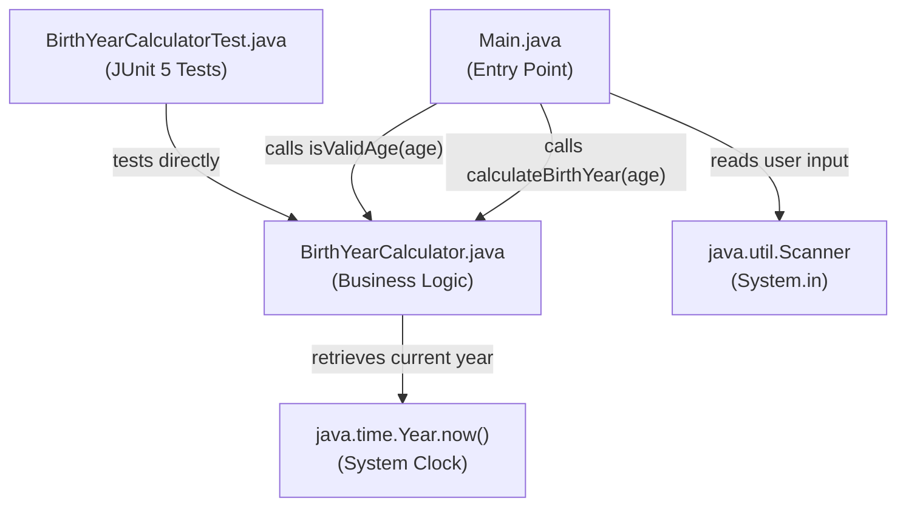

# Technical Specification

# 0. Agent Action Plan

## 0.1 Intent Clarification

### 0.1.1 Core Feature Objective

Based on the prompt, the Blitzy platform understands that the new feature requirement is to create a **Java console application** named **Birth Year Calculator** from scratch in an empty repository. The application calculates a user's birth year based on the age they enter at the console.

The platform interprets the following explicit feature requirements:

- **Console Input via Scanner**: The program must prompt the user to enter their current age using `java.util.Scanner` for console-based input
- **Birth Year Calculation**: The program must subtract the entered age from the current system year to compute the user's birth year
- **Modern Date API Usage**: The current year must be retrieved using the `java.time` API — specifically `Year.now()` or `LocalDate.now()` — rather than deprecated `Date` or `Calendar` APIs
- **Formatted Output**: The result must be displayed in the exact format: `If you are <age> years old, you were born in <birthYear>.`
- **Input Validation**: The program must reject negative numbers, zero, and non-numeric input, displaying meaningful error messages without crashing
- **Exception Handling**: The program must handle `InputMismatchException` gracefully when non-numeric input is entered
- **Reusable Calculation Logic**: The birth year calculation logic must be separated into a reusable method, not embedded directly in `main()`
- **Code Quality**: The application must follow clean coding principles with meaningful variable names and explanatory comments

The platform also surfaces the following implicit requirements:

- A **Maven project structure** must be created since the user specified a Maven-based directory layout (`src/main/java/` and `src/test/java/`)
- A `pom.xml` build descriptor is required to define project coordinates, Java version, dependencies, and build plugins
- The project must be compilable and executable from the command line using `mvn compile exec:java` or `java -cp` after building

### 0.1.2 Optional Enhancement Requirements

The user specified the following optional enhancements that the platform will incorporate into the implementation plan:

- **Repeated Calculations**: Allow the user to perform multiple calculations without restarting the program (loop-based interaction)
- **JUnit Unit Tests**: Add unit tests using JUnit to validate the calculation logic, input validation, and edge cases
- **Birthday Edge Case**: Handle the scenario where the user's birthday has not yet occurred this year (the birth year could be `currentYear - age` or `currentYear - age - 1`)

### 0.1.3 Special Instructions and Constraints

The user has emphasized the following constraints that must be strictly observed:

- **No Deprecated APIs**: Do not use `java.util.Date` or `java.util.Calendar` — only `java.time` API is permitted
- **No Unhandled Exceptions**: Every possible exception path must be caught and handled with user-friendly messages
- **No Hardcoded Year**: The current year must always be dynamically retrieved from the system clock at runtime
- **Clean Code Standards**: Use meaningful variable and method names, add comments explaining the logic, and separate concerns into distinct methods

### 0.1.4 Technical Interpretation

These feature requirements translate to the following technical implementation strategy:

- To **create the project skeleton**, we will initialize a standard Maven project with a `pom.xml` configured for Java 21, JUnit 5.14.2 dependency, and the `maven-compiler-plugin` targeting Java 21
- To **implement the main entry point**, we will create `src/main/java/Main.java` with a `Scanner`-based input loop, calling a separate calculator class for business logic
- To **implement the calculation logic**, we will create `src/main/java/BirthYearCalculator.java` with a static or instance method that accepts an age and returns the birth year using `java.time.Year.now()`
- To **implement input validation**, we will add validation methods in `BirthYearCalculator.java` that reject negative numbers, zero, and non-numeric input before performing the calculation
- To **handle repeated calculations**, we will wrap the input-prompt-calculate-display cycle in a `while` loop with a sentinel exit option (e.g., type "exit" or "quit")
- To **implement the birthday edge case**, we will provide an overloaded method or optional parameter that accounts for whether the user's birthday has already occurred this year
- To **add unit tests**, we will create `src/test/java/BirthYearCalculatorTest.java` with JUnit 5 test methods covering valid inputs, boundary conditions, invalid inputs, and edge cases
- To **update project documentation**, we will rewrite `README.md` with project description, build instructions, usage examples, and project structure overview


## 0.2 Repository Scope Discovery

### 0.2.1 Comprehensive File Analysis

The repository is a **greenfield project** — it contains only a single placeholder file (`README.md`) with the content `# 26Feb_1`. There is no existing source code, build configuration, or test infrastructure. All files must be created from scratch.

**Current Repository State:**

| Path | Type | Status | Description |
|------|------|--------|-------------|
| `README.md` | File | EXISTS — MODIFY | Placeholder file containing only `# 26Feb_1`; must be rewritten with full project documentation |

**Existing Modules to Modify:**

- `README.md` — Replace placeholder content with comprehensive project documentation including build instructions, usage guide, and project structure overview

**Integration Point Discovery:**

Since this is a greenfield Java console application with no external services, databases, or APIs, the integration points are minimal:

- No API endpoints — this is a standalone console application
- No database models or migrations — data is entered and consumed in-memory during a single session
- No service classes, controllers, middleware, or interceptors — the application uses a simple `main()` entry point

### 0.2.2 New File Requirements

**New Source Files to Create:**

| File Path | Purpose | Key Responsibilities |
|-----------|---------|---------------------|
| `pom.xml` | Maven project descriptor | Defines project coordinates, Java 21 compiler configuration, JUnit 5 dependency, and build plugins |
| `src/main/java/Main.java` | Application entry point | Contains `main()` method, `Scanner`-based user input loop, output formatting, and program flow control |
| `src/main/java/BirthYearCalculator.java` | Core calculation logic | Houses the `calculateBirthYear()` method, input validation logic, and birthday edge-case handling |

**New Test Files to Create:**

| File Path | Purpose | Test Coverage Scope |
|-----------|---------|-------------------|
| `src/test/java/BirthYearCalculatorTest.java` | JUnit 5 unit tests | Tests for valid age inputs, zero/negative rejection, boundary values, birthday edge case, and current-year calculation correctness |

**New Configuration Files:**

| File Path | Purpose |
|-----------|---------|
| `pom.xml` | Maven build configuration — Java version, dependencies, plugins |

### 0.2.3 Web Search Research Conducted

The following research was conducted to inform implementation decisions:

- **Java latest stable LTS version**: Confirmed Java 25 LTS (released September 16, 2025) is the latest LTS. Java 21 LTS (released September 2023) is the most widely packaged and supported LTS version across all standard distributions. The project will target **Java 21 LTS** for maximum compatibility and toolchain availability.
- **Maven latest stable version**: Confirmed Apache Maven **3.9.12** is the current stable release, recommended for all users.
- **JUnit latest stable version**: Confirmed JUnit **5.14.2** (released January 6, 2026) is the latest stable JUnit 5 release. JUnit 6.0.3 exists but is brand-new; JUnit 5.14.2 provides the well-established Jupiter API suitable for this project.
- **Maven Compiler Plugin**: Confirmed **3.15.0** is the latest stable version for Maven 3.x.
- **Maven Surefire Plugin**: Confirmed **3.5.5** is the latest stable version for test execution with JUnit 5 support.
- **Java `java.time` API best practices**: The `java.time.Year.now()` and `java.time.LocalDate.now()` APIs are the standard approach for retrieving the current year in modern Java, replacing the deprecated `Calendar.getInstance()` pattern.
- **Scanner input validation patterns**: Best practice for `java.util.Scanner` involves using `hasNextInt()` for type-checking before `nextInt()`, combined with `try-catch` for `InputMismatchException` as a safety net.


## 0.3 Dependency Inventory

### 0.3.1 Private and Public Packages

Since this is a greenfield Java console application, all dependencies are public packages sourced from Maven Central. There are no private or proprietary packages required.

| Registry | Package Group | Package Artifact | Version | Scope | Purpose |
|----------|--------------|-----------------|---------|-------|---------|
| Maven Central | `org.junit.jupiter` | `junit-jupiter-api` | 5.14.2 | test | JUnit 5 Jupiter API for writing unit tests |
| Maven Central | `org.junit.jupiter` | `junit-jupiter-engine` | 5.14.2 | test | JUnit 5 Jupiter test engine for executing tests |
| Maven Central | `org.apache.maven.plugins` | `maven-compiler-plugin` | 3.15.0 | build plugin | Compiles Java source files with `--release 21` flag |
| Maven Central | `org.apache.maven.plugins` | `maven-surefire-plugin` | 3.5.5 | build plugin | Executes JUnit 5 tests during the `test` phase |
| Maven Central | `org.apache.maven.plugins` | `maven-jar-plugin` | 3.4.2 | build plugin | Packages compiled classes into a JAR with `Main-Class` manifest entry |
| JDK 21 (built-in) | `java.util` | `Scanner` | — | runtime | Console input reading via `System.in` |
| JDK 21 (built-in) | `java.time` | `Year` / `LocalDate` | — | runtime | Current year retrieval using the modern date-time API |

### 0.3.2 Dependency Updates

Since this is a new project with no existing codebase, there are no dependency updates, import transformations, or migration changes required. All dependencies will be declared fresh in the new `pom.xml`.

**Import Declarations for New Source Files:**

- `src/main/java/Main.java`:
  - `import java.util.Scanner;`
  - `import java.util.InputMismatchException;`

- `src/main/java/BirthYearCalculator.java`:
  - `import java.time.Year;`

- `src/test/java/BirthYearCalculatorTest.java`:
  - `import org.junit.jupiter.api.Test;`
  - `import org.junit.jupiter.api.DisplayName;`
  - `import static org.junit.jupiter.api.Assertions.*;`

### 0.3.3 Build Configuration

The `pom.xml` must be configured with the following specifications:

- **Project Coordinates**: `groupId` = `com.birthyearcalculator`, `artifactId` = `birth-year-calculator`, `version` = `1.0-SNAPSHOT`
- **Java Version**: `maven.compiler.release` = `21` (uses the `--release` flag for cross-compilation safety)
- **Source Encoding**: `project.build.sourceEncoding` = `UTF-8`
- **JUnit BOM**: Import `org.junit:junit-bom:5.14.2` in `<dependencyManagement>` to ensure consistent JUnit component versions
- **Compiler Plugin**: `maven-compiler-plugin:3.15.0` with `<release>21</release>`
- **Surefire Plugin**: `maven-surefire-plugin:3.5.5` for test execution
- **JAR Plugin**: `maven-jar-plugin:3.4.2` with `<mainClass>Main</mainClass>` in the manifest for direct `java -jar` execution


## 0.4 Integration Analysis

### 0.4.1 Existing Code Touchpoints

Since the repository is essentially empty (containing only a placeholder `README.md`), there are no existing code touchpoints that require modification for integration. The only existing file affected is:

- **`README.md`**: The placeholder content `# 26Feb_1` must be completely replaced with comprehensive project documentation. This is a full rewrite, not a partial modification.

### 0.4.2 Internal Component Integration

The Birth Year Calculator application has a simple two-class architecture with the following integration points between components:



**Direct Integration Points:**

| Source Component | Target Component | Integration Method | Purpose |
|-----------------|-----------------|-------------------|---------|
| `Main.java` | `BirthYearCalculator.java` | Method invocation | Calls `calculateBirthYear(int age)` to compute the result |
| `Main.java` | `BirthYearCalculator.java` | Method invocation | Calls `isValidAge(int age)` for input validation before calculation |
| `Main.java` | `java.util.Scanner` | Constructor + method calls | Creates `Scanner(System.in)` and calls `nextInt()` / `hasNextInt()` for user input |
| `BirthYearCalculator.java` | `java.time.Year` | Static method call | Calls `Year.now().getValue()` to retrieve the current calendar year |
| `BirthYearCalculatorTest.java` | `BirthYearCalculator.java` | Direct method testing | Invokes calculator methods with various inputs and asserts expected results |

### 0.4.3 External Integration Points

This application is a standalone console program with **no external service integrations**:

- No REST APIs or HTTP endpoints
- No database connections or ORM mappings
- No message queues or event streams
- No third-party service authentication
- No file I/O beyond `System.in` and `System.out`

### 0.4.4 Database and Schema Updates

Not applicable — this application operates entirely in-memory with no persistent storage requirements. User input is consumed and results are displayed within a single program execution session.

### 0.4.5 Build System Integration

The Maven build system serves as the primary integration mechanism for compiling, testing, and packaging:

| Build Phase | Plugin | Action |
|-------------|--------|--------|
| `compile` | `maven-compiler-plugin:3.15.0` | Compiles `src/main/java/**/*.java` with `--release 21` |
| `test` | `maven-surefire-plugin:3.5.5` | Discovers and executes JUnit 5 tests in `src/test/java/` |
| `package` | `maven-jar-plugin:3.4.2` | Packages compiled classes into `target/birth-year-calculator-1.0-SNAPSHOT.jar` with `Main-Class: Main` manifest |


## 0.5 Technical Implementation

### 0.5.1 File-by-File Execution Plan

Every file listed below must be created or modified as part of this feature implementation. Files are grouped by functional responsibility and ordered by implementation dependency.

**Group 1 — Project Foundation:**

| Action | File Path | Purpose |
|--------|-----------|---------|
| CREATE | `pom.xml` | Maven project descriptor defining project coordinates (`com.birthyearcalculator:birth-year-calculator:1.0-SNAPSHOT`), Java 21 compiler configuration, JUnit 5.14.2 test dependency, and build plugins (`maven-compiler-plugin:3.15.0`, `maven-surefire-plugin:3.5.5`, `maven-jar-plugin:3.4.2`) |

**Group 2 — Core Feature Files:**

| Action | File Path | Purpose |
|--------|-----------|---------|
| CREATE | `src/main/java/BirthYearCalculator.java` | Core business logic class containing: `calculateBirthYear(int age)` method using `java.time.Year.now()`, `isValidAge(int age)` validation method rejecting zero/negative values, and an overloaded `calculateBirthYear(int age, boolean birthdayOccurred)` for the birthday edge case |
| CREATE | `src/main/java/Main.java` | Application entry point containing: `main(String[] args)` with a `Scanner`-based input loop, output formatting matching the required `"If you are <age> years old, you were born in <birthYear>."` pattern, `InputMismatchException` handling, and a repeat-calculation loop with an exit sentinel |

**Group 3 — Test Coverage:**

| Action | File Path | Purpose |
|--------|-----------|---------|
| CREATE | `src/test/java/BirthYearCalculatorTest.java` | JUnit 5 test class with test methods for: valid age calculation, zero rejection, negative number rejection, boundary age values (1, 150), birthday edge-case logic, and current-year correctness verification |

**Group 4 — Documentation:**

| Action | File Path | Purpose |
|--------|-----------|---------|
| MODIFY | `README.md` | Complete rewrite from placeholder to full project documentation including: project description, prerequisites (Java 21, Maven 3.9+), build/run instructions, usage examples with sample output, project structure overview, and testing instructions |

### 0.5.2 Implementation Approach per File

**Step 1 — Establish Project Foundation** by creating `pom.xml` with all required Maven configuration. This file must be created first because all subsequent compilation and test execution depends on the build descriptor.

**Step 2 — Implement Core Business Logic** by creating `BirthYearCalculator.java`. This class encapsulates the calculation and validation logic in reusable static methods, keeping it decoupled from the I/O layer for testability:

- `calculateBirthYear(int age)` — Returns `Year.now().getValue() - age`
- `isValidAge(int age)` — Returns `false` for values ≤ 0
- `calculateBirthYear(int age, boolean birthdayOccurred)` — Adjusts the result by -1 if the birthday has not yet occurred

**Step 3 — Implement Application Entry Point** by creating `Main.java`. This class handles all user interaction concerns — input reading, output formatting, exception handling, and the repeat-calculation loop — delegating computation to `BirthYearCalculator`:

- Wrap the input-calculate-display cycle in a `while(true)` loop
- Prompt user with option to type "exit" or "quit" to terminate
- Use `Scanner.hasNextInt()` before `Scanner.nextInt()` for type-safe input
- Catch `InputMismatchException` as a safety net and call `Scanner.next()` to consume invalid token

**Step 4 — Implement Unit Tests** by creating `BirthYearCalculatorTest.java` with comprehensive test coverage using JUnit 5 Jupiter annotations:

- `@Test` methods for each validation scenario
- `@DisplayName` annotations for readable test output
- `assertThrows()` for exception-path testing where applicable
- Direct assertion of birth year calculation against `Year.now().getValue() - age`

**Step 5 — Update Documentation** by rewriting `README.md` with complete project documentation that enables any developer to clone, build, and run the application.

### 0.5.3 Key Implementation Patterns

**Calculation Method Signature:**

```java
public static int calculateBirthYear(int age) {
    return Year.now().getValue() - age;
}
```

**Input Validation Pattern:**

```java
public static boolean isValidAge(int age) {
    return age > 0;
}
```

**Output Format (exact specification):**

```plaintext
If you are 30 years old, you were born in 1996.
```

User Example: The user explicitly provided this exact output format as the required standard. All output must match this template precisely, substituting only the `<age>` and `<birthYear>` placeholders.


## 0.6 Scope Boundaries

### 0.6.1 Exhaustively In Scope

The following files, directories, and patterns constitute the complete scope of this feature implementation:

**Source Files:**

| Pattern / Path | Category | Description |
|---------------|----------|-------------|
| `pom.xml` | Build Configuration | Maven project descriptor with all dependency and plugin declarations |
| `src/main/java/Main.java` | Application Source | Entry point with Scanner input loop, output formatting, exception handling |
| `src/main/java/BirthYearCalculator.java` | Application Source | Core calculation and validation logic using `java.time.Year` |
| `src/main/java/**/*.java` | Application Source (wildcard) | All Java source files under the main source tree |

**Test Files:**

| Pattern / Path | Category | Description |
|---------------|----------|-------------|
| `src/test/java/BirthYearCalculatorTest.java` | Unit Tests | JUnit 5 tests for calculation correctness, validation logic, and edge cases |
| `src/test/java/**/*Test.java` | Unit Tests (wildcard) | All JUnit test files under the test source tree |

**Documentation:**

| Pattern / Path | Category | Description |
|---------------|----------|-------------|
| `README.md` | Project Documentation | Full project documentation with build, run, and test instructions |

**Build Artifacts (generated, not committed):**

| Pattern / Path | Category | Description |
|---------------|----------|-------------|
| `target/**` | Build Output | Compiled classes, test reports, and packaged JAR (generated by Maven) |

### 0.6.2 Explicitly Out of Scope

The following items are deliberately excluded from this implementation:

| Excluded Element | Rationale |
|-----------------|-----------|
| Spring Boot REST API version | User listed this as an alternative variant, not a requirement for this implementation |
| Web-based user interface | The requirement specifies a console application; no web UI is needed |
| Database persistence | The application is stateless; no database storage of calculation results is required |
| Logging frameworks (SLF4J, Log4j) | A simple console application uses `System.out` and `System.err`; logging frameworks add unnecessary complexity |
| CI/CD pipeline configuration | No `.github/workflows/`, `Jenkinsfile`, or deployment scripts are specified in the requirements |
| Docker containerization | No `Dockerfile` or container-based deployment is specified |
| IDE-specific configuration | No `.idea/`, `.vscode/`, or `.eclipse/` project files; developers use their preferred IDE |
| Code formatting tools (Checkstyle, SpotBugs) | While valuable, these are not specified in the requirements |
| Integration tests with external systems | The application has no external dependencies to integration-test |
| Performance optimization beyond requirements | The calculation is trivially fast; no optimization work is needed |
| Multi-language or internationalization support | Output format is specified in English only |
| Rule-engine version, beginner-friendly version, or QA test-case version | User listed these as alternative variants they could create separately, not requirements for this implementation |


## 0.7 Rules for Feature Addition

### 0.7.1 API and Library Constraints

The user has explicitly mandated the following technical rules that must be observed without exception:

- **No Deprecated Date/Calendar APIs**: The `java.util.Date` and `java.util.Calendar` classes must never be used anywhere in the codebase. All date/time operations must exclusively use the `java.time` package (`Year.now()`, `LocalDate.now()`, etc.)
- **No Unhandled Exceptions**: Every code path that could throw an exception must be wrapped in appropriate `try-catch` blocks or prevented via defensive checks. The application must never crash with a stack trace visible to the user. Specifically, `InputMismatchException` from `Scanner.nextInt()` must be caught and handled with a user-friendly error message.
- **No Hardcoded Current Year**: The current year must always be retrieved dynamically at runtime using `Year.now().getValue()` or `LocalDate.now().getYear()`. Magic numbers representing years (e.g., `2026`) are strictly prohibited in the calculation logic.

### 0.7.2 Code Quality Standards

- **Clean Coding Principles**: All code must follow established Java naming conventions — `camelCase` for variables and methods, `PascalCase` for classes
- **Meaningful Names**: Variable names like `age`, `birthYear`, `currentYear` must be used instead of abbreviations like `a`, `by`, `cy`
- **Explanatory Comments**: Key logic sections must include comments explaining the "why" — not restating the "what" — of the code
- **Separation of Concerns**: Calculation logic must reside in `BirthYearCalculator.java`, while I/O and program flow must reside in `Main.java`. The calculator class must have no dependency on `Scanner`, `System.in`, or `System.out`

### 0.7.3 Input Validation Rules

The program must enforce the following validation rules on user-entered age values:

| Input Condition | Expected Behavior |
|----------------|-------------------|
| Negative number (e.g., `-5`) | Display error message; prompt again |
| Zero (`0`) | Display error message; prompt again |
| Non-numeric input (e.g., `abc`) | Display error message; consume invalid token; prompt again |
| Valid positive integer (e.g., `30`) | Proceed with calculation and display result |

### 0.7.4 Output Format Rule

The output must match the user-specified format exactly:

```plaintext
If you are <age> years old, you were born in <birthYear>.
```

No deviation from this format is permitted — including capitalization, punctuation, and spacing.

### 0.7.5 Project Structure Rule

The user explicitly specified a Maven project structure that must be followed:

```plaintext
src/main/java/
    Main.java
    BirthYearCalculator.java

src/test/java/
    BirthYearCalculatorTest.java
```

Note that the user's structure places source files directly in `src/main/java/` (default package) rather than in a named package. This structure will be followed as specified, with the classes residing in the default package.


## 0.8 References

### 0.8.1 Repository Files and Folders Searched

The following repository locations were systematically searched and analyzed to derive the conclusions in this Agent Action Plan:

| Path | Type | Tool Used | Findings |
|------|------|-----------|----------|
| `` (root) | Folder | `get_source_folder_contents` | Repository contains a single file: `README.md`. No existing source code, build files, or configuration detected. Confirmed greenfield project. |
| `README.md` | File | `read_file` | Contains only `# 26Feb_1` — a placeholder heading with no project documentation, build instructions, or technical content |

No `.blitzyignore` files were found in the repository. No additional directories or files exist beyond the repository root.

### 0.8.2 External Research Conducted

The following web searches were performed to validate technology selections and version choices:

| Research Topic | Key Finding | Source |
|---------------|-------------|--------|
| Java latest stable LTS version | Java 25 LTS released September 16, 2025; Java 21 LTS is the most widely distributed LTS via standard package managers | Wikipedia — Java version history, Oracle Java SE Support Roadmap |
| Apache Maven latest stable version | Maven 3.9.12 is the current stable release, recommended for all users | maven.apache.org/download.cgi |
| JUnit latest stable version | JUnit 5.14.2 released January 6, 2026 (latest JUnit 5); JUnit 6.0.3 released February 15, 2026 (latest overall) | junit.org release notes, GitHub junit-team/junit-framework |
| Maven Compiler Plugin version | 3.15.0 is the latest stable version for Maven 3.x | maven.apache.org/plugins/maven-compiler-plugin |
| Maven Surefire Plugin version | 3.5.5 is the latest stable version for Maven 3.x | maven.apache.org/surefire/maven-surefire-plugin |

### 0.8.3 Technical Specification Sections Referenced

The following existing technical specification sections were consulted for contextual understanding of the Blitzy Platform's documentation conventions:

| Section | Purpose of Reference |
|---------|---------------------|
| 1.1 Executive Summary | Understood the Reverse Document Generator's role and documentation standards |
| 1.3 Scope | Reviewed in-scope/out-of-scope patterns for alignment with Action Plan format |
| 2.1 Feature Catalog | Reviewed feature documentation structure for consistency |
| 3.1 Programming Languages | Confirmed the platform's language documentation patterns |
| 3.2 Frameworks & Libraries | Reviewed dependency documentation standards and version pinning practices |

### 0.8.4 Attachments

No attachments were provided for this project. The user's requirements were conveyed entirely through the text prompt.

### 0.8.5 Figma Screens

No Figma URLs or design screens were provided. This is a console-based application with no graphical user interface, so no visual design assets are applicable.

### 0.8.6 Environment Configuration

| Configuration Item | Value |
|-------------------|-------|
| Setup Instructions | None provided by user |
| Environment Variables | None specified |
| Secrets | None specified |
| Environment Files | None found in `/tmp/environments_files` |
| Target Runtime | Java 21 LTS (OpenJDK 21.0.10) |
| Build Tool | Apache Maven 3.9.12 |


